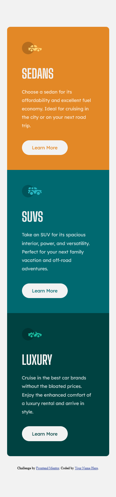

This is my solution to the [3-column preview card component challenge on Frontend Mentor](https://www.frontendmentor.io/challenges/3column-preview-card-component-pH92eAR2-). Frontend Mentor challenges help you improve your coding skills by building realistic projects.

In this solution I played around with the clamp property for some font size and margin. I found that there was a lot of empty space in the sizes in between mobile and desktop so I thought this would be an interesting way to solve it. I still don't 100% understand the clamp function, but for the first time playing with it I'd say it was a success.

- Solution URL: [Frontend Mentor Solution](https://www.frontendmentor.io/challenges/3column-preview-card-component-pH92eAR2-/hub/html5-and-css-with-sass-to-compile-the-css-lJ7nOJgex)
- Live Site URL: [Live Website](https://sleepy-curie-1ee2d4.netlify.app/)

-  Mentor - [@Flamick](https://www.frontendmentor.io/profile/flamick)